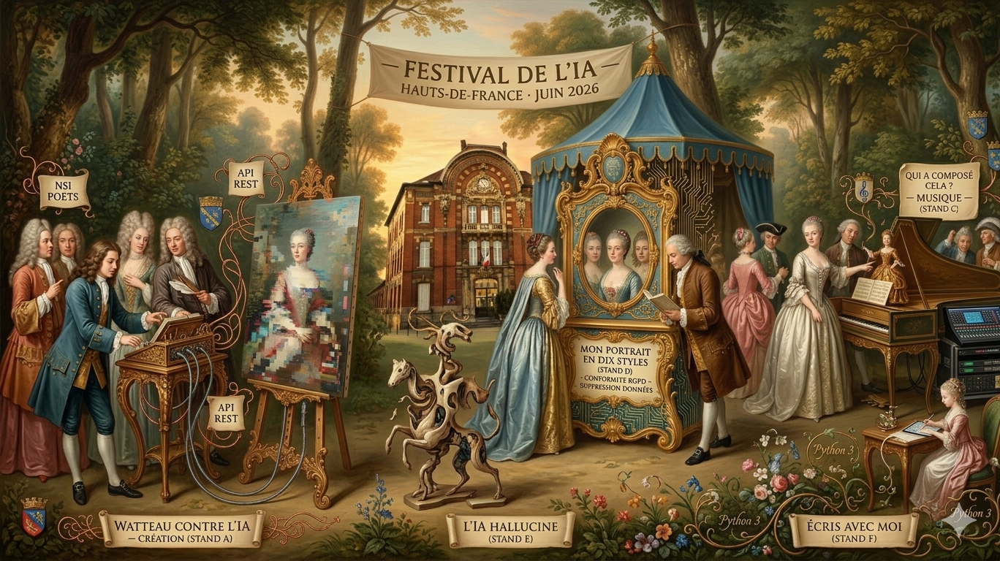

# L'IA Crée — Mais Qui Décide ?



> Exposition interactive et participative — Lycée Antoine Watteau, Valenciennes  
> Semaine de l'IA · Festival Hauts-de-France · **13–19 juin 2026**

---

## Présentation du projet

Ce dépôt regroupe l'ensemble des ressources produites par les élèves de **Première NSI** du lycée Antoine Watteau (Valenciennes) dans le cadre du **Festival de l'IA Hauts-de-France 2026**.

L'exposition *L'IA Crée — Mais Qui Décide ?* propose six stands interactifs où les visiteurs expérimentent concrètement les capacités et les limites des intelligences artificielles génératives, en abordant des questions éthiques, juridiques et techniques au cœur du programme de NSI.

L'affiche de l'exposition s'inscrit dans l'esthétique du peintre valenciennois **Antoine Watteau**, patron symbolique du lycée, mêlant fête galante du XVIIIe siècle et technologies contemporaines.

---

## Les six stands

| Stand | Titre | Notions NSI |
|-------|-------|-------------|
| **A** | *Watteau contre l'IA — Création* | Encodage des images, pixels, API REST |
| **B** | *NSI Poètes* | Traitement de chaînes, génération de texte |
| **C** | *Qui a composé cela ? — Musique* | Représentation audio, fréquence, échantillonnage |
| **D** | *Mon portrait en dix styles* | Formats d'échange JSON, RGPD, suppression de données |
| **E** | *L'IA hallucine* | Fiabilité des sources, biais algorithmiques |
| **F** | *Écris avec moi* | Appels API, historique de messages, co-écriture |

Chaque stand est tenu par un **binôme d'élèves** qui guide les visiteurs et anime les démonstrations.

---

## Contenu du dépôt

```
.
├── index.html                   # Page web de présentation de l'exposition
├── stands/
│   ├── stand_a/                 # Scripts et interfaces — Création visuelle
│   ├── stand_b/                 # Scripts et interfaces — Poésie
│   ├── stand_c/                 # Scripts et interfaces — Musique
│   ├── stand_d/                 # Scripts et interfaces — Portrait (RGPD)
│   ├── stand_e/                 # Scripts et interfaces — Hallucinations IA
│   └── stand_f/                 # Scripts et interfaces — Co-écriture
├── assets/
│   └── watteau.png              # Affiche de l'exposition
└── README.md
```

---

## Technologies utilisées

- **Python 3** — Scripts de traitement et appels API
- **HTML / CSS / JavaScript** — Interfaces des stands
- **API Claude (Anthropic)** — Génération de contenu (texte, style)
- **API REST** — Échanges de données entre client et serveur
- **Raspberry Pi** — Déploiement physique sur les stands
- **Impression thermique** — Restitution des productions aux visiteurs

---

## Compétences NSI mobilisées

Ce projet couvre l'ensemble des thèmes du programme de **NSI de Première** :

**Représentation des données** — encodage des images (pixels, RVB), représentation audio (fréquence, échantillonnage), formats d'échange JSON et CSV, encodage Unicode.

**Algorithmique et programmation** — fonctions et modules Python, traitement de chaînes de caractères, gestion de fichiers, appels asynchrones et gestion d'erreurs.

**Web et interactions** — requêtes HTTP (GET / POST), utilisation d'API REST avec clés d'accès, HTML, CSS et JavaScript, collecte et affichage de données en temps réel.

**Société et numérique** — propriété intellectuelle et droits d'auteur, protection des données personnelles (RGPD), biais algorithmiques et représentativité, fiabilité des sources.

---

## Rétroplanning

| Période | Étape |
|---------|-------|
| Fin avril – mai 2026 | Constitution des équipes, soumission du dossier sur ia-avecnous.fr, prise en main des outils |
| Mai 2026 | Développement des scripts Python et des interfaces, mise en place des relais serveur |
| 1re semaine de juin 2026 | Répétition générale, installation du matériel, vérification des protocoles RGPD |
| 13 – 19 juin 2026 | Exposition ouverte à la communauté scolaire, animation par rotation des binômes |

---

## Notes RGPD

Le stand D (*Mon portrait en dix styles*) implique la capture temporaire d'une image du visage du visiteur. Conformément au RGPD :

- aucune donnée biométrique n'est conservée au-delà de la session ;
- le visiteur peut demander la suppression immédiate de ses données à tout moment ;
- un panneau d'information et un formulaire de consentement sont affichés à l'entrée du stand.

---

## Auteurs

Élèves de **Première NSI** — Lycée Antoine Watteau, Valenciennes  
Encadrement pédagogique : équipe NSI du lycée  
Festival Hauts-de-France de l'IA — Juin 2026

---

## Licence

Ce projet est partagé à des fins **pédagogiques et non commerciales**.  
Les productions des élèves restent leur propriété intellectuelle.  
L'affiche de l'exposition a été générée avec l'assistance d'un outil d'IA générative.
